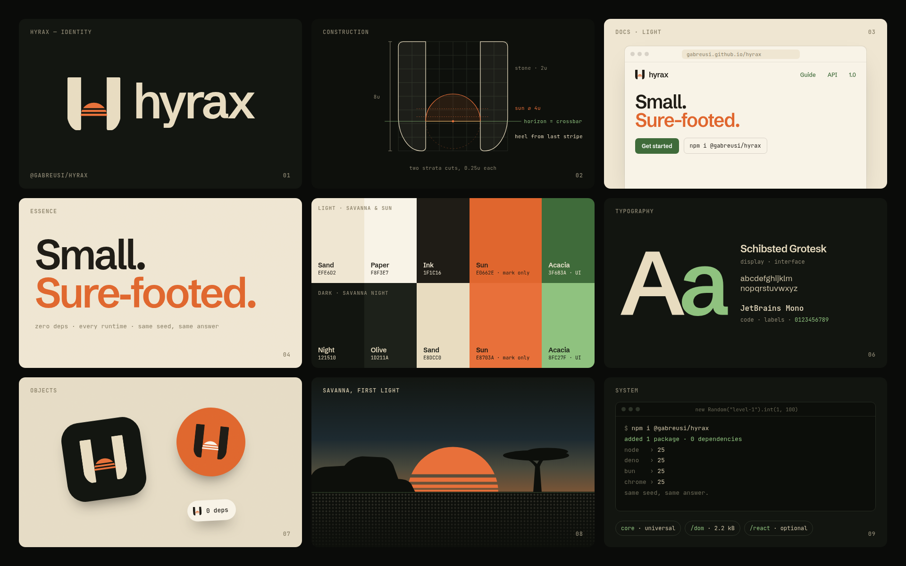

# Brand

## The mark

Two stones and a sun on the horizon between them. The sun is the H's crossbar. The stones end in a one-sided heel that
starts at the sun's last stripe: a hint of the hyrax's teeth, not a fang.

| File             | Use                                                                    |
| ---------------- | ---------------------------------------------------------------------- |
| `mark.svg`       | Adapts to the reader's color scheme (`prefers-color-scheme`)           |
| `mark-light.svg` | On light backgrounds                                                   |
| `mark-dark.svg`  | On dark backgrounds                                                    |
| `mark-mono.svg`  | One color (`currentColor`), for print, embossing and single-ink places |
| `icon.svg`       | Favicon and app icon: the dark mark on a rounded Night tile            |

The mark is drawn on a 96-unit grid (8u, u = 12). Keep clear space of at least 1u around it. At 16px the stripes and
the heel fade out and it reads as a plain H, which is intended.

## Color

`palette.json` holds both palettes with a role for every color.

- **Light, Savanna & Sun:** sand, paper, ink, sun, acacia.
- **Dark, Savanna Night:** night, olive, sand, sun, acacia (lighter).

The one rule: **orange is the sun.** It appears in the mark and in at most one highlighted word per view. Links, buttons
and focus rings use acacia green in both modes.

## Type

Schibsted Grotesk for display and interface, JetBrains Mono for code and labels.

## Voice

Tagline: "Small. Sure-footed." Supporting line: "zero deps · every runtime · same seed, same answer".
